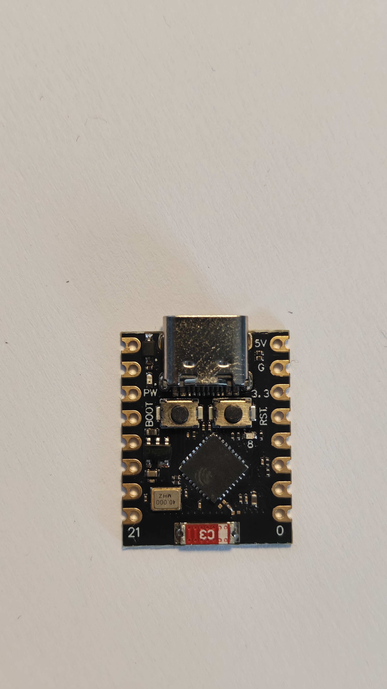
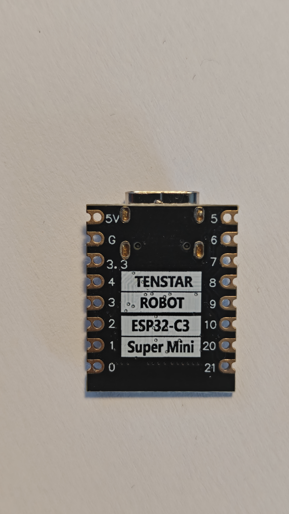
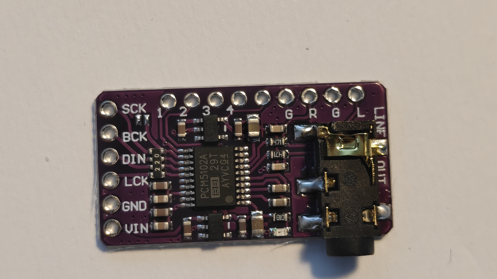
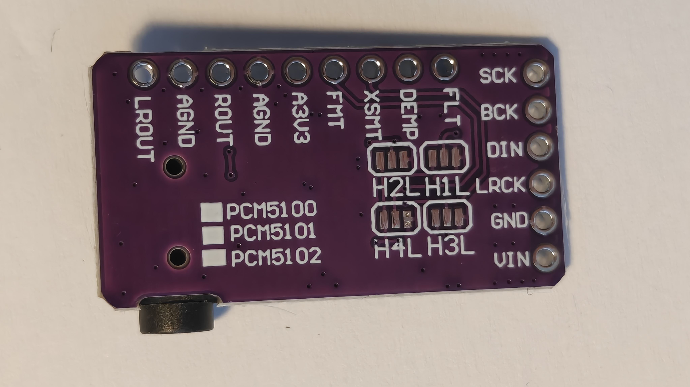
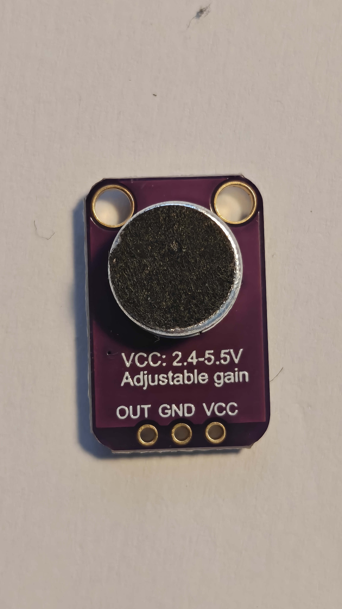
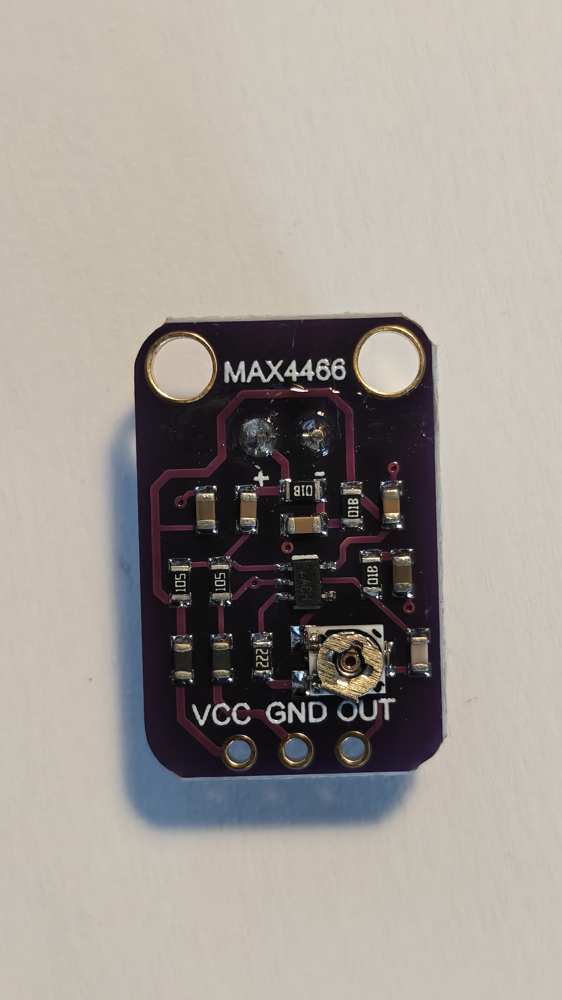
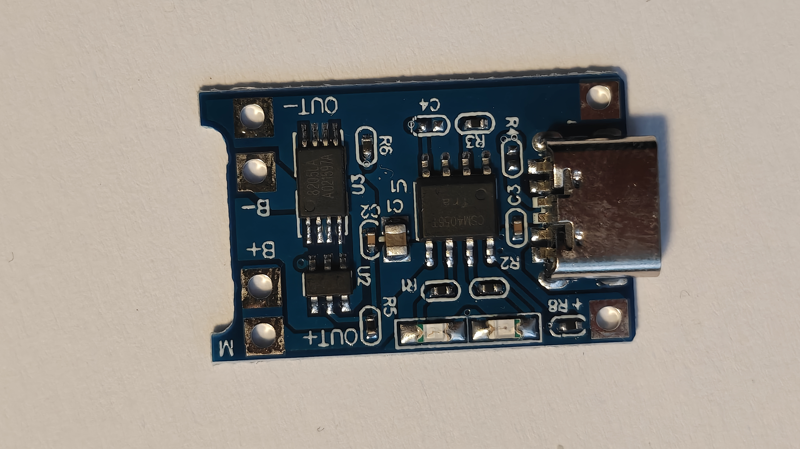
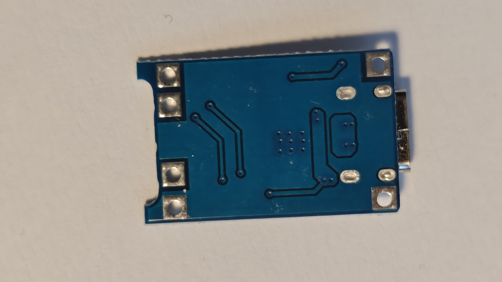

# Hardware measurements — fills pcb.md §7

Caliper + bench session with the four real modules on the bench. **No footprint is
drawn from internet dimensions** — every KiCad footprint comes from a number in the
tables below. **This file must be complete before KiCad layout** (pcb.md §9,
DESIGN §12 mechanical item).

Fill `Measured` and `Date` as you go. `Nominal` values are the datasheet/expected
figures from [pcb.md](pcb.md) §2/§7 — flag any measured value that disagrees.

**Bench meter:** ANENG A9002 handheld DMM. Good for steady-state microamp reads
(e.g. deep-sleep current); it **cannot** capture sub-millisecond WiFi-TX current
bursts, so TX-burst current figures stay modeled/estimated, not bench-measured.

**Bench session:** 2026-07-18 (Finn), calipers + ANENG A9002 + loupe. Reference
photos live in [`images/`](images/) and are embedded per module below.

**Photogrammetry session:** 2026-07-26. Every socket position the carrier draws now
comes from a calibrated two-sided photo of the real module, not from calipers and not
from a datasheet — see [§ Photogrammetry](#photogrammetry-hwpin_locs--the-numbers-the-carrier-actually-uses)
below. Where the two disagree, the photogrammetry wins and the caliper row is marked
_superseded_.

---

## ⚠️ Findings that disagree with nominal — READ BEFORE KiCad layout

These change footprints / floorplan and must be reconciled into `pcb.md` (and DESIGN
where noted) **before** layout starts:

1. **PCM5102A is ~31.8 mm long, not ~27 mm** (+~5 mm). The `~70 × 50 mm` floorplan
   (pcb.md §1/§6) must be re-checked against a 32 mm module.
2. **PCM5102A analog end is a 1×9 header, not a 1×3 `L G R`.** Real silk (jack→digital):
   `LROUT AGND ROUT AGND A3V3 FMT XSMT DEMP FLT`. Our analog taps become
   **X = LROUT, Y = ROUT, ground = AGND**. pcb.md §1/§2 socket **J3 = 1×3 female `L G R`
   is wrong** → it must become a 1×9 socket (or a partial socket over the LROUT/AGND/ROUT
   pins). This is the biggest change.
3. **PCM5102A has an on-board output reconstruction filter** (`471` ≈ 470 Ω series parts +
   caps near the outputs), not bare DAC pins. This is a filter, **not** DC-blocking — the
   output stays ground-centered (DESIGN §5 assumption holds). Consequence is only for R10/R11:
   with ~470 Ω already in series, **fit 0 Ω links** — settled 2026-07-28 (pcb.md §10 Q2), and
   *not* on the Phase-4 bench ramp, which cannot resolve it: 100 Ω against 470 Ω is 0.01 % of
   amplitude and ≲0.07° of phase at 10 kHz, equally on both channels.
4. **SuperMini LDO marking reads `S2LC`, not the expected `S2QB`.** Decode/confirm the
   current rating (need ≥ ~0.35 A for WiFi TX peaks) before trusting it. Not the feared
   250 mA `LLVB`, but not the verified 500 mA `S2QB` either.
5. **Q10 RESOLVED:** SuperMini USB-C `VBUS` **is** directly tied to the `5V` pin
   (meter-confirmed). ⇒ the "never plug USB-C while the battery switch is ON" rule is
   **mandatory** (USB would back-feed the cell). Close Q10.

6. **TP4056 output pads are NOT on a 2.54 grid** (2026-07-26 photogrammetry). They are
   two pairs — `OUT−`/`B−` at 3.526 mm and `B+`/`OUT+` at 3.106 mm — with a 7.43 mm
   gutter between them, spanning nearly the whole 17.3 mm edge. No stock 1×2 socket
   mates with that, so J5/J6 became generated footprints at the measured pitches.
7. **PCM5102A row-to-row offset was 4.06 mm out** (2026-07-26 photogrammetry). The 1×6
   I2S column is not collinear with the 1×9 row and sits past its FLT end; see the
   PCM5102A table below. This is the socket the v1.0 board got wrong.

Non-blocking notes: SuperMini PCB width measures 17.8 mm (nominal 18 — fine). TP4056
charger IC is marked `CSM4056T` (a TP4056 equivalent) with `8205LA` (FS8205) + DW01-type
protection — behaves per spec (continuity checks pass).

---

## ESP32-C3 SuperMini

<p>


</p>

Photos: [front](images/ESP32C3_FRONT.jpg) · [back](images/ESP32C3_BACK.jpg)

| Measurement | Nominal | Measured | Date |
|---|---|---|---|
| Board outline L × W | 22.5 × 18 mm | **22.5 × 17.8 mm** (PCB); **24 mm** L incl. USB-C overhang. Width 17.8 vs 18 — OK | 2026-07-18 |
| Pin-row pitch | 2.54 mm | 2.54 (0.1″ header) ✓ | 2026-07-18 |
| Pins per row | 8 | 8 ✓ | 2026-07-18 |
| Row-to-row spacing | 15.24 mm | ~15.2 (reads 15.24) ✓ | 2026-07-18 |
| First-pin offset from each board edge | — | **1.3 mm** on USB-C end, **2.8 mm** on antenna end (edge → inside of pin hole) | 2026-07-18 |
| Antenna end (which end) + overhang of antenna region from last pin row | — | **Non-USB-C end.** Integrated PCB antenna (silk `C3`), **flush with board edge — 0 mm overhang** (copper keep-out, not a mechanical overhang) | 2026-07-18 |
| USB-C end (which end) + connector overhang past board edge | — | **Opposite the antenna.** Connector overhangs **~1.5 mm** past the board edge | 2026-07-18 |
| Pin silk order of both rows vs pcb.md §2 table | matches §2 | ✓ **matches §2.** Back silk: L col `5V G 3.3 4 3 2 1 0`, R col `5 6 7 8 9 10 20 21`. Board marked "TENSTAR ROBOT ESP32-C3 Super Mini" | 2026-07-18 |
| Bottom-side component height (socket clearance) | ≤ ~8.5 mm | **~8.3 mm** ✓ (within 8.5; socket clearance OK but tight) | 2026-07-18 |
| LDO marking (SOT-23-5, loupe) | ME6211C33 ("S2QB"); beware "LLVB" = 250 mA | ⚠️ **reads `S2LC`** — not `S2QB`, not `LLVB`. Decode + confirm ≥0.35 A rating before trusting | 2026-07-18 |
| USB-C VBUS ↔ 5 V pin beep test (direct tie?) — Q10 | expected tied | ✅ **CONFIRMED tied** (meter continuity). ⇒ USB back-feeds the cell — the "no USB while batt switch ON" rule is mandatory. **Closes Q10.** | 2026-07-18 |

## GY-PCM5102A (purple)

<p>


</p>

Photos: [front](images/PCM5102A_FRONT.jpg) · [back](images/PCM5102A_BACK.jpg)

| Measurement | Nominal | Measured | Date |
|---|---|---|---|
| Board outline L × W | ~27 × 17 mm | ⚠️ **~31.8 × 17 mm** — module is ~5 mm LONGER than nominal. Re-check the 70×50 floorplan | 2026-07-18 |
| 6-pin header pitch | 2.54 mm | 2.54 (0.1″ header) ✓ | 2026-07-18 |
| 6-pin header offset | — | on the short (digital) edge; single 1×6 row | 2026-07-18 |
| 6-pin header order silk | SCK BCK DIN LCK GND VIN | ✅ **`SCK BCK DIN LCK GND VIN`** (top→bottom on the short edge) — matches | 2026-07-18 |
| ~~3-pin analog header position~~ → **actual: 1×9 analog/control header** | (assumed 1×3 `L G R`) | ⚠️ **NOT a 3-pin header.** It is a **1×9 header along the long edge.** Analog out lives here: use **X=LROUT, Y=ROUT, gnd=AGND.** → pcb.md **J3 must be 1×9, not 1×3** | 2026-07-18 |
| 9-pin header order silk | (n/a) | Back silk, jack-end → digital-end: **`LROUT AGND ROUT AGND A3V3 FMT XSMT DEMP FLT`** (front abbreviates the analog end `… G R G L`) | 2026-07-18 |
| 9-pin header distance from 6-pin row | — | ~~PROVISIONAL (phone-measured): 1×6 row axis +2.54 mm from FLT, SCK collinear with the 1×9 row~~ **SUPERSEDED — the guess was 4.06 mm out.** Photogrammetry: SCK (J2 pin 1) sits **26.917 mm west and 0.583 mm south** of LROUT (J3 pin 1), i.e. the 1×6 column is *past* the FLT end of the 1×9 row and **not** collinear with it. Worst pin 0.180 mm off an ideal 2.54 mm socket. See §Photogrammetry | 2026-07-26 |
| 3.5 mm jack overhang | may hang off carrier edge | **~1.6 mm** (jack makes total 18.6 vs 17 mm board) — hangs off edge, fine | 2026-07-18 |
| Solder-bridge state (DESIGN §5) | 1=L, 2=L, 3=H, 4=L | Pads present on back: **`H1L H2L H3L H4L`** (+ `PCM5100/5101/5102` selector). State not readable from photo — **verify by continuity** against 1=L,2=L,3=H,4=L | _verify_ |
| Series R/filter on L/R outputs? (trace or measure) | expect none (fit 0 Ω if present) | ⚠️ **Filter PRESENT** — `471` (≈470 Ω) series parts + caps sit between the DAC and the output pins/jack. Confirm whether LROUT/ROUT are pre- or post-filter. **R10/R11 resolved 2026-07-28: fit 0 Ω links** (pcb.md §10 Q2) — the module's 470 Ω already does the isolating | 2026-07-18 |

## MAX4466

<p>


</p>

Photos: [front](images/MAX4466_FRONT.jpg) · [back](images/MAX4466_BACK.jpg)

| Measurement | Nominal | Measured | Date |
|---|---|---|---|
| Board outline L × W | ~20 × 13 mm | **20.8 × 13.5 mm** ✓ | 2026-07-18 |
| Header pitch | 2.54 mm | 2.54 (3-pin 0.1″) ✓ | 2026-07-18 |
| Header offset | — | 3-pin row centered on one short edge | 2026-07-18 |
| Pin order silk (clones differ) | VCC GND OUT | ✅ **`VCC GND OUT`** reading from the back (op-amp) side; front (capsule side) silk mirrors it as `OUT GND VCC`. Matches §2 J4 — wire the pigtail by **back** silk | 2026-07-18 |
| Capsule diameter + position (silk aperture circle) | — | electret capsule **~9.7 mm** dia, top-center on the capsule (front) side; 2× mounting holes at top corners | 2026-07-18 |
| Gain trimmer position (reachable when socketed?) | — | multiturn trimpot on the **back** (component) side, bottom-center → **screwdriver-reachable on the ~10 cm pigtail** ✓ | 2026-07-18 |

## TP4056 (USB-C, blue — CSM4056T + DW01-type + FS8205)

<p>


</p>

Photos: [front](images/TP4056_FRONT.jpg) · [back](images/TP4056_BACK.jpg)

| Measurement | Nominal | Measured | Date |
|---|---|---|---|
| Board outline L × W | ~26 × 17 mm | **26.9 × 17.3 mm** — but see §Nubs: 26.9 is the **nub-inclusive** length. The main body is **25.2 mm**; two depanelization tabs at the OUT−/OUT+ corners add 1.6 mm | 2026-07-18, refined 2026-07-27 |
| B+, B−, OUT+, OUT− pad positions + drill | ~2.54 grid (usually *almost*) | Order confirmed: THT pads on the left short edge, top→bottom **`OUT− · B− · B+ · OUT+`** (+ `M` mounting mark). ⚠️ **"~2.54 grid" is WRONG** — photogrammetry gives **0 / 3.526 / 10.960 / 14.066 mm**: two pairs (3.53 and 3.11 pitch) with a 7.43 mm gutter, spanning nearly the whole 17.3 mm edge. Nothing on a 2.54 grid mates with it. See §Photogrammetry. ⚠️ **Hole ⌀ revised 2026-07-27: ~1.5 mm, not 2.0** (calipers give 1.43; the photogrammetry's 2.0 "nominal" was pulled up by a single bad pick reading 2.60 against 1.65 / 1.61 / 1.41 for the other three). Slack per pin is therefore **~0.45 mm with 0.5 mm machined round pins**, not ±0.55 — still clear of the 0.25 mm gate | 2026-07-26 |
| IN+ / IN− pads: drilled or SMD-only? position | — | **drilled** — ~2.8 mm bare-copper squares on **1.68 mm** plated holes, one at each USB-C-end corner, in line with OUT+ (`+` silk, beside `R8`) and OUT−. **21.65 mm** from the output row. These are now the carrier's **second mount row** (J9/J10), not just a sense tap — see §The second mount row | 2026-07-18, positioned 2026-07-28 |
| USB connector type (micro-B vs USB-C) + overhang | — | **USB-C**; overhang **1.4 mm** (28.3 − 26.9) | 2026-07-18 |
| RPROG value (read resistor / marking) | 1.2 kΩ → 1 A default | **measured 1.19 kΩ** (no legible marking) ⇒ ~1 A default ✓ | 2026-07-18 |
| B+ ↔ OUT+ continuity | 0 Ω (same copper) | ✅ **continuous** (0 Ω) | 2026-07-18 |
| B− ↔ OUT− non-continuity | open (protection FET) | ✅ **open** (protection FET present) | 2026-07-18 |

_ICs: main charger marked `CSM4056T` (TP4056-equivalent), `8205LA` = FS8205 dual FET,
`U2` = DW01-type protection. Behaves per the nominal TP4056+DW01+FS8205 spec._

### Nubs, and the pad-row → edge offset — ✅ CLOSED 2026-07-27

**This was the last item gating the gerber plot.** It is closed, the module seats as drawn,
and **nothing in the layout moves.**

The module's west edge (the one behind the output pads) **is not straight**: two
depanelization tabs protrude at the OUT− and OUT+ corners. In
[`images/TP4056_FRONT.jpg`](images/TP4056_FRONT.jpg) they are bare soldermask — no copper,
no silk, no component, no trace running out to them. **They get filed flush at assembly**
(see the reduction below for why that is not cosmetic).

Calipers, module in hand, all distances to the **near rim** of the hole (rim, not centre —
that is what a caliper jaw can actually reach):

| # | From → to | Measured |
|---|---|---|
| A | north long edge → OUT− near rim | **1.2 mm** |
| B | OUT+ near rim → south long edge | **1.1 mm** |
| C1 | **nub** west edge → OUT−/OUT+ near rim | **2.64 mm** |
| C2 | **main** west edge → B−/B+ near rim | **1.0 mm** |
| D1 | overall length, **with** nubs | **26.8 mm** |
| D2 | overall length, **without** nubs | **25.2 mm** |
| E | OUT− ↔ OUT+, nearest rims | **12.4 mm** |
| F | OUT− ↔ OUT+, farthest rims | **15.25 mm** |
| — | board width, edge to edge | **17.3 mm** |

**Reduction 1 — the N/S seat, which is what the gate asked for.** The hole radius is
unknown, but it *cancels*, because A and B are both measured to the near rim:

```
column centre from north edge = ( (A + r) + (17.3 − B − r) ) / 2
                              = (1.2 + 16.2) / 2 = 8.70 mm       <- r cancels
half width                    = 17.3 / 2         = 8.65 mm
                                        => column sits 0.05 mm SOUTH of body centre
```

The board model puts it **0.12 mm south of centre** (1.81 / 14.066 / 1.57). **Δ = 0.07 mm
against a 0.25 mm gate.** No shift toward D1 (0.31 mm north), none toward the control row.

**Reduction 2 — the nubs are the 26.9-vs-25.75 contradiction.** D1 = 26.8 ≈ the 2026-07-18
caliper 26.9 (which included the tabs); D2 = 25.2 is the body. The photogrammetry's 25.75
was hand-clicked corners **averaging across a stepped edge**, which is why it agreed with
neither — exactly the failure `hw/pin_locs/TP4056.txt` warns about. Filed vs not:

| | west edge lands at | clearance to RV1 body (`x 32.05…41.55, y 37.0…50.0`) |
|---|---|---|
| **filed flush** | x ≈ 43.9 — within **0.15 mm** of the modelled 43.91, on any assumed hole ⌀ | **2.4 mm** |
| unfiled | x ≈ 42.2 | **~0.7 mm** |

The SW nub and the pot overlap in Y, so unfiled leaves 0.7 mm between a PCB corner ~4 mm up
and an 11.3 mm-tall pot body. Not a collision — but filing costs 30 s per module and makes
the as-built match the model.

**Reduction 3 — the east end moved ~0.8 mm west.** `east edge = column + D2 − (1.0 + r)
≈ column + 23.3` against the modelled `+24.07`, so the body ends at **x ≈ 69.0–69.2** with
~1 mm of board left, not 0.2 mm. The USB-C jack overhangs the body by 1.4 mm, so its face
sits only **~0.5 mm proud of the carrier's east edge** instead of ~1.2 mm. More clearance,
not less — but it is an **enclosure input**: the charge-port opening must clear a USB-C
**plug overmold** reaching a nearly-flush jack, so that wall wants a local relief or a
recessed cutout.

**Reduction 4 — the span disagrees by ~0.3 mm, and it does not matter.** E/F give a pad span
of **13.83 mm** and hole ⌀ **1.43 mm**; A/B/width independently give span ≈ 13.6; the
photogrammetry says 14.066. Both caliper routes land short in the same direction, which is
predictable: the photogrammetry's **scale came from a caliper reading of this same 17.30 mm
width**, so a ~1.7 % scale error is precisely what its warning block says it cannot separate
from the result. Consequence at assembly: with ~1.5 mm holes and ~0.5 mm machined round pins
there is ~0.45 mm of radial slack per hole, and a 0.27 mm span error puts the two end pins
0.13 mm off centre. It drops on. **Assembly order matters though — see [pcb.md](pcb.md) §5:
pins into the module first, then onto the carrier.**

**Why the model is not being edited.** Every delta is either inside the gate (N/S, 0.07 mm)
or in the direction of *more* clearance (east, 0.8 mm). `TP4056_OUTLINE` feeds
`audit_board.py`'s under-module checks and `gen_board.py`'s silk/keep-out placement, so
editing `hw/pin_locs/TP4056.json` would force a full `gen_board.py` + `route.py` re-run and a
`ROUTE_SEED` re-sweep (pcb.md §9 — a stale seed fails silently as a severed ground pour) to
buy nothing. The measured deltas are recorded here instead.

### The second mount row (J9 + J10) — added 2026-07-28

**This one did move copper**, and it is the answer to a question the fit gate cannot ask:
*the module seats — but does it stay put?*

J5/J6 put all four pins in **one column at one end of the module**. The USB-C jack is at the
other end, **21.65 mm away**. A row of pins resists rotation about its own axis only by
**bending**, so that geometry is a diving board with a plug being pushed into the free end:

```
   4 x 0.64 mm square pin, ~5 mm free length, E ~ 100 GPa
   I = pi*d^4/64 = 3.1e-15 m^4      per-pin moment stiffness EI/L = 0.061 N*m/rad
   four in a line, all on the axis  => ~0.25 N*m/rad total
   a 5 N off-axis nudge on the jack => 5 N x 0.0217 m = 0.11 N*m => ~25 deg
```

The number is crude (the socket grips the pin over several mm, so the real figure is stiffer)
but the order of magnitude is the point: **grams of side load, tens of degrees of tilt**, on
the one connector that gets handled every single charge cycle. Repeated USB-C insertion —
10–20 N of axial force at that lever — also works the pins back and forth in their sockets.

The fix was already half-built. The module has **two ~2.8 mm bare-copper pads on ~1.65 mm
plated holes** at the USB-C-end corners, one in line with each OUT pad — the "+" one visible
beside `R8` in [`images/TP4056_FRONT.jpg`](images/TP4056_FRONT.jpg). The carrier already had a
pad on one of them (`J9`, the IN+ sense tap, drawn as a wire pad). It is now a **socket**, and
a second one (`J10`) was added on the other corner, turning a 4-in-a-line mount into a
**4-corner mount**.

| | Value | Source |
|---|---|---|
| Mount row ← output row | **21.65 mm** | **caliper 2026-07-28** — overrides the photogrammetry |
| Mount pads, N ↔ S span | **14.20 mm** | photogrammetry (`loose pins`), calibrated axis |
| Offset from OUT−/OUT+ | −0.32 mm N / +0.18 mm S | photogrammetry — both sit slightly *outboard* |
| Hole ⌀ | **1.68 mm** | photogrammetry (1.773 / 1.588); calipers agree at 1.65 |
| Slack per pin | **0.39 mm** radial | (1.68 − 0.90) / 2, 0.64 mm square pin |

**Why one number is caliper and the rest are picks.** The caliper reading was
`inner 20.0 / outer 23.3` between an OUT hole and the corner hole opposite it, and
`(20.0 + 23.3)/2 = 21.65 mm` **independent of either hole's diameter**. The photogrammetry
says 22.30 mm — 0.65 mm more, which is **more than the 0.39 mm slack**, i.e. the difference
between a pin that drops in and one that does not. The picks are wrong here and it is
predictable: `hw/pin_locs/TP4056.txt` warns that the frame is a **similarity** and its scale
comes from the 17.30 mm reference measured **across** the output row, so the along-row axis is
metric and the perpendicular one carries the residual perspective. The same stretch reads the
body as 25.75 mm long against a measured 25.2 mm. Independent cross-check, and it is the
convincing one — the picks put these pads **1.68 mm inboard of the clicked east edge**, a
short local distance the stretch barely touches, and

```
25.2 (body)  −  (1.0 + r) (west edge → output row, from C2)  −  1.68 (picks)
      r = 0.91 (picks' hole)  =>  21.61 mm
      r = 0.75 (caliper hole) =>  21.77 mm
```

— it still carries the output row's unknown hole radius, so it is a bracket rather than a
number, but the bracket is **21.6…21.8 mm** and the caliper's 21.65 sits in it. A third route
agrees: scaling the picks' whole length axis by the body's own error (25.2 / 25.75) turns
22.30 into **21.82**. Three routes inside 0.2 mm, and the 22.30 outside all of them. So the
rule the code follows is: **across the row → photogrammetry; along the module → caliper.**

Using the picks for the across-row numbers is deliberate even though Reduction 4 shows that
axis may itself be ~1.7 % long: **J5/J6 are built in that same frame.** The module is one
rigid part, so a common-mode scale error moves the mount row and the output row together and
still drops on. Mixing frames on one axis is what would not.

**Escape hatch if a pin will not enter.** The corner pads are ~2.8 mm of copper around a
1.68 mm hole and carry no current on this board (J10 is on no net; J9 carries the IN+ sense
tap). **Drill them to 2.0 mm** and the slack goes from 0.39 mm to 0.55 mm with a 0.4 mm
annular ring still left to solder to. Do that only if needed — the three routes above agree
to ±0.2 mm, against 0.39 mm of slack.

**J10 is on no net on purpose.** [pcb.md](pcb.md) §2 lists TP4056 `IN−` as "the same node
module-internally" as `OUT−`, which is the usual protected-TP4056 topology (the FS8205 is in
the cell-negative leg, so charge return passes through it). That is an **assertion, not a
measurement** — the 2026-07-18 bench session measured `B+ ↔ OUT+` and `B− ↔ OUT−`, never
`IN− ↔ OUT−`. If it is wrong on this module, bonding `IN−` to carrier GND shorts across the
protection FETs and the DW01 can no longer disconnect anything. A floating pin anchors the
module exactly as well, so the pad is netless and the question stays open. **If you want it
bonded:** ohm `IN−` against `OUT−`, and if it reads 0 Ω, run a wire from J10 to any GND pad.

## Photogrammetry (`hw/pin_locs`) — the numbers the carrier actually uses

Calipers give you a board outline and a pitch. What a socket needs is the position of
every pin *relative to every other pin*, and that is what the caliper session could not
supply — the two numbers it guessed at (the PCM5102A's row-to-row offset and the
TP4056's "~2.54 grid") were both wrong, and both were wrong in the layout.

Method: two calibrated photographs per module (front and back), pin holes picked by
hand on both faces, a homography fitted to the pin lattice, and only the through-holes
confirmed from *both* sides kept. Origin is pin 1 of the module's primary row.
Raw output — CSV, JSON and annotated overlays — lives in [`hw/pin_locs/`](../../hw/pin_locs/).

`hw/carrier/tools/measured.py` is the only consumer: it re-expresses each module in a
row-aligned frame, least-squares-fits an *ideal* 2.54 mm socket to each row, and hands
the layout the pair (offset, worst residual). Nothing in the board is typed in by hand —
re-measure a module, drop the new CSV in, re-run `gen_board.py`, and the board follows.
`python3 tools/measured.py` prints the table below live.

| Quantity | Value (mm) | Worst pin | Note |
|---|---|---|---|
| PCM5102A J3 (1×9) | datum = J3 pin 1 (LROUT) | 0.117 | within-row scatter, irreducible |
| PCM5102A J2 (1×6) from J3.1 | **(−26.917, +0.583)** | 0.180 | the layout chooses this offset — the one number that was guessed before |
| PCM5102A outline from J3.1 | x −28.47…+3.55, y −1.40…+15.97 | — | 32.0 × 17.4 mm |
| TP4056 pads from OUT− | **0 / 3.526 / 10.960 / 14.066** | — | ~1.5 mm holes ⇒ ~0.45 mm slack on 0.5 mm machined pins (was "2.0 mm ⇒ ±0.55"; §Nubs reduction 4). Calipers read the span 0.24 mm shorter — absorbed by the slack, not acted on |
| TP4056 J6 from J5.1 | (0.000, +10.960) | — | the 7.43 mm gutter between the pairs |
| TP4056 J9 (IN+) from J5.1 | **(+21.650, +13.910)** | — | mount row, and the X is **caliper, not picks** — the picks say +22.358 and that is 0.65 mm of a 0.39 mm slack budget. §The second mount row |
| TP4056 J10 (IN−) from J5.1 | **(+21.650, −0.292)** | — | same, other corner. Netless: mechanical anchor only. Neither J9 nor J10 is a fit datum (they would measure the override) |
| TP4056 outline from J5.1 | x −1.81…+24.07, y −1.82…+15.64 | — | 25.9 × 17.5 mm. ⚠️ **Corners were hand-clicked across the stepped (nubbed) west edge** — calipers 2026-07-27 give **x −1.75…+23.3** with the nubs filed. Kept as-is deliberately: the deltas are inside the gate or add clearance, and editing it forces a re-route. §Nubs |
| ESP32-C3 JA1 (5V row) from JB1.1 | (−0.018, +15.240) | 0.100 | confirms the nominal 15.24 row spacing |
| ESP32-C3 outline from JB1.1 | x −20.98…+1.39, y −1.32…+16.57 | — | 22.4 × 17.9 mm |
| MAX4466 1×3 pitch | 2.5400 | 0.066 | on a pigtail — fit not constrained |

Acceptance gate is **0.25 mm per pin**, the misalignment a 2.54 mm female header takes
before a rigid module pin fouls the barrel. All three socketed modules pass with margin
(worst: PCM5102A 0.180 mm at J2.5). `tools/audit_board.py` re-checks this against the
actual board on every build, so a placement edit cannot silently break a module fit.

Two facts the millimetre tables cannot carry, both taken from the pixel coordinates:

- **Handedness.** A module plugs in component-side-up, so the front photo and the KiCad
  top view are the *same* view. If the declared carrier mapping flips that determinant,
  the two socket rows are swapped end-for-end and every net lands on the wrong pin —
  which is exactly what v1.0 did to the SuperMini. `measured.Placed._check_mirror` now
  raises rather than generating that board.
- **Which row is which.** The SuperMini's back silk reads `5V G 3.3 4 3 2 1 0` down the
  left column with USB-C up, so on the component side that column is on the right. With
  the antenna west (§6.1 rule 3) the 5V row therefore lands **south** — JA1 south, JB1
  north.

## Bought parts

| Measurement | Nominal | Measured | Date |
|---|---|---|---|
| RCA output pads (X = PCM5102A L, Y = PCM5102A R): signal pad ↔ reused ~50 cm RCA cable tip; ground pad ↔ RCA shell | signal via R10/R11 (**0 Ω links**); ground pad = board GND, shell = GND | design item (no module to measure) — pads are simple signal+AGND lands. **Note:** analog source is now **LROUT/ROUT off the 9-pin header**, and a module-side 470 Ω filter exists (see PCM5102A ⚠️) — which is why R10/R11 settled at **0 Ω, closed 2026-07-28** (pcb.md §10 Q2) | _design_ |
| SW1 slide-switch pin pitch | 2× 3-pin @ 2.0 or 2.54 mm | ✅ **CLOSED — and it is neither: the SS12D00 is 2.5 mm.** Read off the seller's mechanical drawing, so no part in hand and no paper doll were needed, and nothing in the layout moved. 2.5 lands **0.05 mm off the centre** of the slot's 2.00–2.90 mm window — the nominal was wrong in *both* directions and the slot is why that cost nothing. Pins **0.5 × 0.3 mm**: 0.30 mm a side across a 0.90 mm slot, and the ⌀0.9 centre hole takes the middle pin. Body **8.5 × 3.7 mm on the pin centreline**, inside the footprint's 9.0 × 4.0 silk with 0.25 mm a side in X, 0.15 in Y; clearances TP4056 body 2.51 mm N, J8 courtyard 0.96 mm E, board edge 1.75 mm S; 1.5 mm actuator sweeps X 48.23–51.73 with 3.46 mm of nail room. Middle terminal is the common, matching pad 2 = VLOAD. **Slots re-cut 2026-07-28 to 1.80 × 0.90 mm (aspect 2.0, was 1.44 × 0.90 = 1.6)** — JLCPCB will not plate a slot under 2×, and a silent conversion to a round hole fits no pitch at all. ⬜ **Still to check at assembly:** locating lug — the drawing has no bottom view, and the footprint has the three signal holes only, so clip any lug | 2026-07-28 |
| TP4056 pad-row → module edge offsets | — | ✅ **CLOSED — the module seats as drawn.** Pad column sits 0.05 mm south of body centre vs 0.12 mm modelled ⇒ **Δ 0.07 mm against a 0.25 mm gate**. Also resolved the 26.9-vs-25.75 length contradiction: the west edge carries two **depanelization nubs** (+1.6 mm) that get **filed flush** at assembly. Full reduction and the raw A–F caliper readings in §Nubs | 2026-07-27 |
| RV1 pot | (was undecided) | ✅ **RV097NS-B10K**, 5-pin **mono with switch**, **right-angle / side-adjust** (shaft parallel to the board, exiting the south edge — *not* vertical, as this row implied until 2026-07-27), body **27.3 × 9.5 × 11.3 mm**, metal shaft. **No knob** — turned by hand → enclosure needs only a shaft hole. Resolves Q3 + Q9 | 2026-07-18 |
| RV1 row-2 geometry vs the RV097NS footprint | "bracket lugs" from the generic RV09 drawing: 9.5 mm apart, 7.0 mm behind the pot row, oval 1.2 × 2.0 slots | ✅ **WRONG — corrected 2026-07-27.** The part is *5-pin mono **with switch***; it has no bracket lugs. Row 2 is an SPST on ⌀1.0 holes **5.0 mm apart, 6.25 mm behind** the pot row, and the **mounting surface is 5.0 mm in front of** the pot row (was drawn at 1.2 mm). Every row-2 pad was 2.25 mm out in X and 0.75 mm in Y — the part would not have gone in. Source: the seller's mechanical drawing (`5Pin Mono (with Switch)`, [drawing](https://i.ebayimg.com/images/g/3KIAAOSwd9VjM8EZ/s-l1600.webp)), which agrees exactly with KiCad's stock `Potentiometer_Alps_RK097_Single_Horizontal_Switch` (from ALPS `rk097.pdf`) | 2026-07-27 |
| RV1 body cross-section (the check that identifies the part) | — | ✅ drawing says **9.5 mm** wide and 6.5 + 4.85 = **11.35 mm** tall; the 2026-07-18 calipers said **9.5 × 11.3**. Independent confirmation that this drawing is our part. The third caliper figure, 27.3 mm, is the back-of-body-to-shaft-tip length: drawing gives body 13.0 + shaft L 15.0 = 28.0 nominal, so **re-measure that one** — 0.7 mm unexplained, though it changes no hole position | 2026-07-27 |

## Power path — nothing measured yet

Every number in [pcb.md](pcb.md) §4.3 is paper. The 2026-07-26 design review found two of
them wrong on paper, so the bench values matter. There is no row here yet because the test
cannot run on the current USB-only rig (no battery, no TP4056 in circuit, Q1 is SOT-23) — it
moves to the assembled carrier via TP1/TP2/TP3. Fill these in when it does:

| Measurement | Expected | Measured | Date |
|---|---|---|---|
| TL431 trip point (VSW rising), R7/R8 = 8.2 k/10 k + TL431A | **≈4.56 V** (window 4.46–4.66) | _pending_ | |
| State 1 VBAT→VLOAD drop at 150 mA | < 20 mV | _pending_ | |
| **State 4 cell current, source sagged to 4.4 / 4.5 / 4.6 V**, milliohm shunt, SoC 3.6–4.0 V | ≤ 1 mA — *this is the one the review says will fail* | _pending_ | |
| State 2/3 cell trickle while charging (D1 Schottky fitted) | ≤ 1 mA | _pending_ | |
| State 6 standby current at the cell | ~260 µA fully populated / ~30 µA on a JP1 plan-A board | _pending_ | |
| U1 / Q2 TO-92 lead order vs the footprint (ohm REF against R7/R8) | REF on the pad wired to VSW_SENSE | _pending_ | |

Also still open and **resolvable now on the USB rig**: the SuperMini LDO marking `S2LC`
(recorded above) is undecoded and the carrier has **no fallback LDO footprint**, so if it turns out to
be a ~250 mA part there is no board-level remedy. Stress-test it: run NETWORK streaming with
`WiFi.setSleep(false)` and watch for resets or rail sag. If sustained streaming already works
on these boards without resets, that closes the current-rating half of the question — record
it here.
