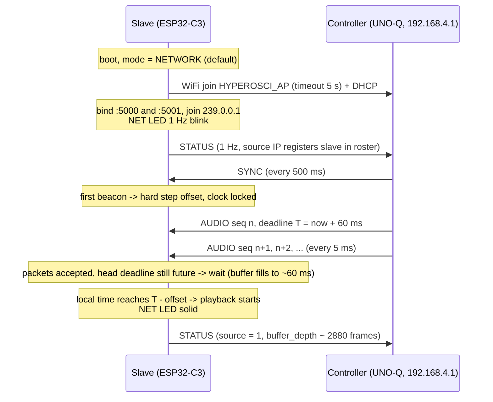
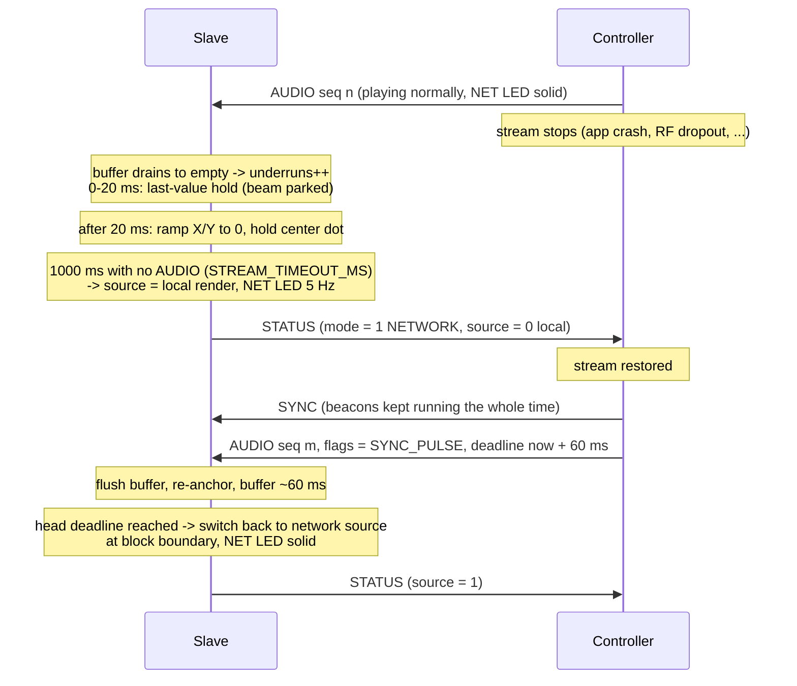
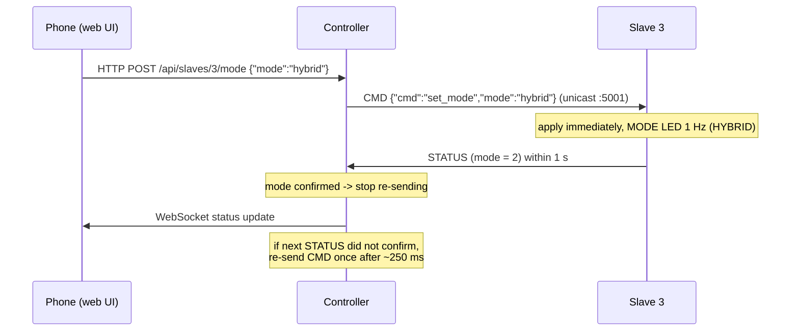

# HYPEROSCI Wire Protocol v1

**Status:** Normative. This document plus `src/esp32-slave/include/protocol.h` define the wire protocol.
`protocol.h` is authoritative for byte layouts (it is shared verbatim with the UNO-Q controller build);
this document is authoritative for behavior. A mismatch between the two is a bug — fix both together.
Constants referenced here mirror `src/esp32-slave/include/config.h` and [DESIGN.md](DESIGN.md) §8.

**Audience:** slave firmware dev and the future UNO-Q controller dev. Everything a controller
implementation needs is here; it never needs to read the slave source.

---

## 1. Transport overview

All traffic is UDP over the controller's own WiFi AP:

| Item | Value |
|------|-------|
| AP SSID / passphrase | `HYPEROSCI_AP` / `hyperosci2026` (WPA2-PSK) |
| Band | **2.4 GHz only** (`hw_mode=g`, channel 1/6/11 — ESP32-C3 has no 5 GHz radio) |
| Controller address | `192.168.4.1` (static; slaves get DHCP, typically `192.168.4.2+`) |
| Multicast group | `239.0.0.1` (optional transport, see below) |
| Byte order | **Little-endian** for every multi-byte field |

### 1.1 Ports and flows

| Port | Name | Direction | Contents | Rate |
|------|------|-----------|----------|------|
| **5000** | `PORT_AUDIO` | controller → slaves | `HYPE_AUDIO` | 200 packets/s per slave (one 5 ms block each) |
| **5001** | `PORT_CTRL` | controller → slaves | `HYPE_SYNC` every **500 ms**; `HYPE_CMD` on demand | 2/s + sporadic |
| **5002** | `PORT_STATUS` | slave → controller (learned IP, port 5002) | `HYPE_STATUS` | 1/s per slave (`STATUS_INTERVAL_MS`) |

Socket layout:

- **Slave** binds `0.0.0.0:5000` and `0.0.0.0:5001`, and joins multicast group `239.0.0.1` so it
  receives audio/sync/cmd whether the controller sends unicast or multicast (transport-agnostic,
  DESIGN.md §2). STATUS is sent to **the source IP of the most recent SYNC/CMD packet**, port 5002,
  from any source port. Learning the controller address (instead of hardcoding `192.168.4.1`) is
  deliberate: it lets the Python test-streamer (running on the UNO-Q) work on any AP/subnet during weeks 1–3. A slave
  that has never received a SYNC/CMD sends no STATUS. The controller must identify slaves by the
  STATUS payload (`mac`, `slave_id`) and the datagram's source IP, never by source port.
- **Controller** binds `:5002` to receive STATUS, and uses one ordinary UDP socket to fan out
  AUDIO/SYNC/CMD (see §10). Slaves validate packets by magic/version (§2.2), not by source address.

### 1.2 Why unicast-per-slave is the default (multicast optional)

Per DESIGN.md §2: 802.11 **multicast frames are sent at the lowest basic rate, with no link-layer
ACKs or retries**, and many AP stacks additionally throttle or drop multicast under power-save
(DTIM buffering). Unicast frames get MCS rates and automatic retries. With only 4 slaves at
~1.6 Mbps each, unicast fan-out costs ~6.5 Mbps total — trivially affordable (§8) — and is far more
robust. Therefore:

- **AUDIO — default:** the controller sends every AUDIO packet 4× as unicast, one `sendto()` per
  discovered slave. It MAY instead send a single copy to `239.0.0.1:5000` (slaves cannot tell the
  difference); use only if unicast fan-out is ever a measured problem.
- **SYNC — always multicast** to `239.0.0.1:5001`. This is deliberate and load-bearing: SYNC is the
  **discovery bootstrap**. A slave learns the controller's IP from the first SYNC it receives and
  only then starts sending STATUS; the controller learns each slave's IP from STATUS and only then
  starts unicasting AUDIO to it. If SYNC were unicast-only, neither side could ever learn the
  other (deadlock). The multicast-at-basic-rate concern that rules out multicast for audio is
  irrelevant here: a 20 B beacon at 2 Hz costs nothing, and losing beacons is harmless (staleness
  needs ~10 consecutive losses).
- CMD is always unicast to one slave in v1 (slaves would accept a group-addressed CMD identically,
  but the v1 controller does not send one).

**Cold-boot sequence:** controller beacons SYNC to the group from startup → slave joins the group,
receives SYNC, learns the controller IP, starts 1 Hz STATUS → controller adds the slave to its
roster, starts its unicast AUDIO stream. No mDNS, no static slave IPs, no configuration.

Related requirement: slaves run with WiFi modem sleep **off** while streaming
(`WiFi.setSleep(false)`), otherwise DTIM buffering adds 100+ ms jitter (DESIGN.md §2).

```
UNO-Q 192.168.4.1
  ├── :5000 AUDIO ──unicast──▶ slave1:5000 … slave4:5000   (200 pps each, 988 B)
  ├── :5001 SYNC ──multicast─▶ 239.0.0.1:5001              (every 500 ms, 20 B — discovery beacon)
  ├── :5001 CMD ────unicast──▶ slaveN:5001                 (on demand, JSON)
  └── :5002 ◀──────────────── slaveN → STATUS              (1 Hz, 54 B, starts after first SYNC)
```

---

## 2. Datagram framing

Every datagram on ports 5000/5001/5002 starts with the 20-byte `HypeHeader`. Structs are packed
(`__attribute__((packed))`), no padding anywhere. All multi-byte integers little-endian — native on
both the ESP32-C3 (RV32) and the UNO-Q's QRB2210 (ARM64), so both sides can cast the buffer to the
struct directly.

### 2.1 HypeHeader (20 bytes)

| Offset | Size | Field | Type | Description |
|--------|------|-------|------|-------------|
| 0 | 4 | `magic` | `uint32_t` | `HYPE_MAGIC` = `0x45505948`. On the wire the bytes are `0x48 0x59 0x50 0x45` = ASCII `"HYPE"` |
| 4 | 1 | `version` | `uint8_t` | `HYPE_PROTO_VERSION` = **1** |
| 5 | 1 | `type` | `uint8_t` | see packet-type table below |
| 6 | 2 | `flags` | `uint16_t` | bit 0 = `HYPE_FLAG_SYNC_PULSE` (`0x0001`, AUDIO only, §5.4). All other bits: send 0, ignore on receive |
| 8 | 4 | `seq` | `uint32_t` | per-type monotonically increasing counter (§2.3) |
| 12 | 8 | `timestamp_us` | `uint64_t` | controller monotonic clock, µs (§4). For STATUS: slave local µs clock |

Packet types (`HypePacketType`):

| Value | Name | Port | Direction | Payload |
|-------|------|------|-----------|---------|
| `0x01` | `HYPE_AUDIO` | 5000 | controller → slaves | 8-byte subheader + samples (§3.1) |
| `0x02` | `HYPE_SYNC` | 5001 | controller → slaves, every 500 ms | none — header only (§3.2) |
| `0x03` | `HYPE_CMD` | 5001 | controller → slave | UTF-8 JSON (§3.3) |
| `0x04` | `HYPE_STATUS` | 5002 | slave → controller, every 1 s | 34 bytes (§3.4) |

### 2.2 Receive validation (both sides)

In order:

1. UDP payload length < 20 → drop silently.
2. `magic != 0x45505948` (LE read; equivalently `memcmp(buf, "HYPE", 4)`) → drop silently.
3. `version != 1` → drop (a v1 node cannot parse other versions; see §9).
4. `type` unknown → **ignore silently** (forward compatibility, §9).
5. Type-specific length check (given per type in §3) → drop if malformed.
6. Unknown `flags` bits → ignore the bits, process the packet.

Receivers MUST accept datagrams longer than the expected payload and ignore trailing bytes
(this is the v2 extension mechanism, §9). For AUDIO the payload length is derived from
`frame_count`; for CMD from the UDP datagram length.

### 2.3 Sequence numbers

`seq` increments by 1 per packet **per type** at the sender. The controller keeps one counter per
type and sends the **same** `seq` value to all four slaves for a given AUDIO/SYNC packet (the four
unicast copies are the same logical packet), so per-slave loss stats are comparable. Each slave
keeps its own counter for STATUS. Receivers MUST NOT assume `seq` starts at 0 (the controller may
restart mid-show); the first packet seen defines the baseline. Slaves use AUDIO `seq` only for gap
detection (§6); SYNC/CMD gaps are not tracked.

---

## 3. Packet layouts

### 3.1 HYPE_AUDIO — port 5000, controller → slaves

`timestamp_us` = **playback deadline of the FIRST frame in this packet**, on the controller clock
(§4, §5). Header `flags` bit 0 (`HYPE_FLAG_SYNC_PULSE`) marks a resync point (§5.4).

| Offset | Size | Field | Type | Description |
|--------|------|-------|------|-------------|
| 0 | 20 | header | `HypeHeader` | `type` = `0x01` |
| 20 | 4 | `sample_rate` | `uint32_t` | **48000** in v1. Slaves drop packets with any other rate (counted in `rx_dropped`) |
| 24 | 2 | `frame_count` | `uint16_t` | stereo frames that follow. **240** in v1 (`HYPE_AUDIO_FRAMES`) |
| 26 | 2 | `reserved` | `uint16_t` | send 0, ignore on receive |
| 28 | `frame_count`×4 | `samples` | `int16_t[]` | interleaved **L,R** per frame; **L = scope X, R = scope Y**; full-scale ±32767 |

Datagram length MUST equal `28 + 4 × frame_count`. The v1 controller MUST send
`frame_count = 240` (exactly 5 ms at 48 kHz); v1 slaves MAY drop any other value as malformed.

**Total: 20 + 8 + 960 = 988 bytes** — comfortably under the 1472-byte no-fragmentation limit for
UDP over Ethernet-MTU WiFi. Rate: 200 packets/s per slave (one per 5 ms block).

### 3.2 HYPE_SYNC — port 5001, controller → slaves, every 500 ms

Header only, **20 bytes**, no payload. `timestamp_us` = controller clock sampled as close as
possible to the moment of transmission (§10). Slaves compute
`offset = timestamp_us − local_us_at_rx` and smooth it (§4.2). v1 deliberately ignores flight time
— justification in §4.3.

### 3.3 HYPE_CMD — port 5001, controller → slave

Payload = UTF-8 JSON, **not** null-terminated; length = UDP datagram length − 20. Keep commands
≤ 512 bytes. `timestamp_us` is informational only (send time); slaves execute immediately on
receipt. Unknown `"cmd"` values and malformed JSON are ignored silently (a console log line is
fine). Commands defined in v1:

| Command | Effect on slave |
|---------|-----------------|
| `{"cmd":"set_mode","mode":"network"\|"local"\|"hybrid"}` | switch active mode, exactly as a MODE-button press would (DESIGN.md §7). Lowercase strings. Invalid `mode` → ignored |
| `{"cmd":"identify"}` | blink both status LEDs for 3 s (physically locate a unit) |
| `{"cmd":"set_gain","gain":0.0..1.0}` | set the slave's **master output gain** — scales every source (network, local, hybrid) at the I2S output stage, i.e. an amplitude trim for the scope. Out-of-range values clamped. **Persisted to NVS** (survives reboot); same knob as the console `gain` command |
| `{"cmd":"reboot"}` | immediate restart (`esp_restart`) |

CMD has **no ACK**. Confirmation is observational: the next STATUS (≤ 1 s later) reflects the new
`mode`. Commands are idempotent, so the controller SHOULD re-send once (~250 ms later) if
unconfirmed (§10).

### 3.4 HYPE_STATUS — port 5002, slave → controller, every 1 s

`timestamp_us` = slave's local µs clock (informational; the controller must not mix it with its
own clock). Datagram length MUST equal **55** (20 + 35).

| Offset | Size | Field | Type | Description |
|--------|------|-------|------|-------------|
| 0 | 20 | header | `HypeHeader` | `type` = `0x04` |
| 20 | 6 | `mac` | `uint8_t[6]` | slave STA MAC — the stable identity key |
| 26 | 1 | `slave_id` | `uint8_t` | default = MAC last octet; overridable via serial console |
| 27 | 1 | `mode` | `uint8_t` | active mode: 0 = LOCAL, 1 = NETWORK, 2 = HYBRID |
| 28 | 1 | `source` | `uint8_t` | what is actually playing: 0 = local render (fallback), 1 = network stream |
| 29 | 1 | `rssi_dbm` | `int8_t` | current WiFi RSSI |
| 30 | 2 | `vbat_mv` | `uint16_t` | battery voltage, millivolts |
| 32 | 2 | `buffer_depth_frames` | `uint16_t` | jitter-buffer depth at send time (target ≈ 2880 frames = 60 ms) |
| 34 | 4 | `rx_packets` | `uint32_t` | AUDIO packets accepted since boot |
| 38 | 4 | `rx_dropped` | `uint32_t` | AUDIO packets discarded: late / stale-clock / overflow / bad rate (§6) |
| 42 | 4 | `underruns` | `uint32_t` | playout ticks that found the buffer empty (§6) |
| 46 | 4 | `uptime_s` | `uint32_t` | seconds since boot |
| 50 | 4 | `clock_offset_us` | `int32_t` | current smoothed sync offset, saturated to int32 range |
| 54 | 1 | `local_pattern` | `uint8_t` | local-render pattern (drawn whenever `source=0`): 0 = mic, 1 = circle, 2 = lissajous, 3 = ramp, 4 = square |

`mode` vs `source` distinction matters for the UI: a slave in NETWORK mode with a lost stream
reports `mode=1, source=0` (fallback active — NET LED blinking 5 Hz). `source` is smoothed on
the slave: brief (<150 ms) concealment gaps still report `source=1` so the 1 Hz sampling doesn't
flap the UI; a real fallback (rebuffer or stream timeout) reports 0.

STATUS doubles as **discovery**: there is no mDNS in v1. The controller builds its roster from
incoming STATUS packets, keyed by `mac`, storing the source IP as the unicast destination for
AUDIO/SYNC/CMD. A slave that hasn't sent STATUS for ~3 s is shown as offline.

---

## 4. Clock & synchronization model

(`protocol.h` cross-references this section for `timestamp_us`.)

### 4.1 Clocks

- **Controller clock (the master timebase):** a monotonic microsecond counter on the UNO-Q's Linux
  side — `clock_gettime(CLOCK_MONOTONIC)` divided down to µs. Epoch is arbitrary (app start). It is
  never wall-clock time, never NTP-adjusted, and MUST be sampled by the same process that
  timestamps both SYNC and AUDIO packets (§10).
- **Slave clock:** `esp_timer_get_time()` — local monotonic µs since boot.
- Crystal accuracy on both sides is tens of ppm; that is ≤ ~10 µs of relative drift per 500 ms
  beacon interval — negligible against the ±5 ms budget, but it accumulates (~1–2 ms of buffer
  creep per minute), which §5.3 handles.

### 4.2 Offset estimation on the slave

On each SYNC beacon (every 500 ms):

```
raw_offset = timestamp_us − local_us_at_rx      // "controller minus local", signed 64-bit
```

so at any later moment `controller_now ≈ local_now + offset`, and a controller-clock deadline `T`
converts to local time as `T_local = T − offset`.

Smoothing (normative behavior, tunable constants marked •):

1. Push `raw_offset` into an 8-entry sliding window; estimate = **median of the 8**
   (mean of the two middle values). The window spans 4 s of beacons; occasional beacons delayed by
   WiFi retries/queueing land in the upper tail and are rejected outright.
2. *(RECOMMENDED, not implemented in v1)* The **applied** offset slews toward the median at a
   bounded rate — •500 µs per second — so a momentary estimate wobble never causes a step in
   deadline evaluation. **The v1 firmware applies the median directly**; jumps are bounded by
   beacon jitter and absorbed by the ±`DEADLINE_SLACK_US` window plus the deadline-continuity
   check on the buffer (a large controller-epoch jump shows up as a >20 ms stream discontinuity
   and triggers a rebuffer).
3. *(RECOMMENDED)* **Hard step** (applied = median immediately, jitter buffer flushed) when: first
   lock after boot/reconnect, the clock was stale (below), or |median − applied| > •20 ms. In v1
   this falls out of the direct-median behavior plus the continuity rebuffer above.

Staleness: if no SYNC arrives for `SYNC_STALE_MS` = **5000 ms** (~10 missed beacons) the offset is
stale. The slave keeps playing free-running (its crystal is easily good enough over minutes) and
switches from deadline-based scheduling to holding buffer depth near target; the next beacon
re-locks with a hard step if needed.

### 4.3 Why flight time is ignored (no RTT compensation)

A one-way beacon measures `offset + flight_time`, biasing all slaves' offsets slightly negative.
On a single WiFi hop from the AP itself, flight time is µs-scale in air plus queueing that is
typically well under 2 ms; the median-of-8 discards retry-delayed outliers. Two facts make the
residual bias irrelevant:

1. The v3.1 requirement is **±5 ms** (`DEADLINE_SLACK_US` = 5000). A ≤2 ms one-sided bias fits.
2. What the audience sees is **relative** sync between the four scopes, and all four slaves incur
   nearly the same bias, which cancels. The absolute (controller-to-scope) error only shifts total
   latency by that same ≤2 ms — invisible inside the ~70 ms end-to-end pipeline.

NTP-style RTT measurement would need a request/response exchange per slave for a correction that
buys nothing. Rejected for v1.

---

## 5. Audio streaming model

### 5.1 Deadline semantics

Each AUDIO packet's `timestamp_us` is the playback deadline of its **first** frame; frame *k*
within the packet is due at `timestamp_us + k × 1e6 / 48000` (≈ 20.833 µs per frame; each 240-frame
packet spans exactly 5000 µs, so consecutive packets' timestamps differ by exactly 5000). The
controller stamps deadlines ~`JB_TARGET_DEPTH_MS` = **60 ms** in the future (§10), which is how the
jitter buffer acquires its depth: the slave simply refuses to play early.

### 5.2 Slave accept / drop / wait policy

On packet receive (after §2.2 validation and the `sample_rate`/`frame_count` checks):

| Condition (local deadline `D = timestamp_us − offset`, now `t`) | Action |
|---|---|
| clock never locked (no SYNC yet) | **buffer and play depth-gated** (deadline policy suspended). Deliberate: a slave that can hear audio but not sync still puts pictures on its scope — degraded, never dark. Sync engages retroactively at first lock via the continuity check. |
| `D < t − DEADLINE_SLACK_US` (5000 µs) — too late (clock locked) | drop, `rx_dropped++` |
| earlier than the buffer's current tail deadline (duplicate/reordered) | drop, `rx_dropped++` |
| 1–20 ms past the tail deadline (packets lost ahead of this one) | hold-fill the gap with the last frame, then append |
| > 20 ms past the tail deadline (epoch jump / long outage) | flush, re-anchor on this packet, rebuffer |
| buffer full (`JB_CAPACITY_FRAMES` = 24576 ≈ 512 ms) — overflow | drop, `rx_dropped++` |
| otherwise (deadline-contiguous with the tail, ±1 ms rounding tolerance) | append |

On each playout tick (the I2S write of one 240-frame block, every 5 ms):

- Head frame's deadline more than `DEADLINE_SLACK_US` in the **future** → not yet: output hold
  frames (§6), don't consume. This is the "wait" side and covers cold-start buffering.
- Head frame within ±`DEADLINE_SLACK_US` of now → consume and play. Normal case.
- Head frame more than `DEADLINE_SLACK_US` **late** (can happen after a stall) → discard frames
  until the head is inside the window, count one `underruns` event's worth of discards into
  `rx_dropped` accounting as appropriate.

The actual guarantee: **each slave plays every frame within ±5 ms of its deadline, quantized to
5 ms block boundaries** (late catch-up discards whole 240-frame blocks), so worst-case
per-slave deadline error transiently reaches ~7 ms after a stall. **Slave-to-slave skew** — the
thing the audience can see — stays at sync-estimate error (≤1–2 ms) plus at most one block of
quantization difference, because all slaves apply identical policies to the identical packet
stream. Tightening to sub-block skips (§5.3) is the v2 lever if long-set drift is ever visible.

### 5.3 Drift management inside the window

The I2S consumer runs at 48 kHz off the slave crystal; the controller produces at 48 kHz off its
own. Tens of ppm of relative drift ≈ 1–2 ms of buffer creep per minute, so the head-of-buffer
deadline error trends slowly toward one edge of the ±5 ms window. Rather than waiting to hit the
edge and correcting by a visible 5 ms jump, the slave SHOULD nudge continuously: when the smoothed
head error exceeds ~half the slack (•2.5 ms), drop or duplicate a **single frame** per block until
back near zero. One frame is 20.8 µs — utterly invisible on a scope trace. *(RECOMMENDED — the v1
firmware corrects only at the window edge, in whole 5 ms blocks; revisit if drift is visible over
long sets.)*

### 5.4 `HYPE_FLAG_SYNC_PULSE` (header flags bit 0)

Set by the controller on the first AUDIO packet of a new stream segment (stream start, preset
change that resets its pacing epoch, seek). Meaning to the slave: *the discontinuity in `seq`
and/or `timestamp_us` at this packet is intentional* — flush the jitter buffer, re-anchor on this
packet's deadline, and do not count the gap in loss statistics. Slaves must tolerate never seeing
it (pure cold-join works without it, §7.1).

---

## 6. Loss handling

Design stance: **no retransmit, no FEC, no NACK.** At 200 pps a retransmitted packet would usually
arrive after its deadline anyway; concealment is cheaper and the content is a repeating vector
image, so a lost 5 ms block is nearly invisible.

- **Gap detection:** by **deadline continuity**, not `seq` (which is stats-only): a packet whose
  `timestamp_us` lands 1–20 ms past the buffer's tail deadline implies lost packets ahead of it —
  the hole is hold-filled (§5.2 table) so the buffer stays contiguous. The v1 buffer is
  append-only; a reordered packet arriving after its successor is dropped (already-covered time).
- **Concealment ladder** (also applies to underrun, i.e. buffer empty at playout tick):
  1. **0–20 ms of missing signal:** last-value hold — repeat the last played (X,Y) frame. The beam
     parks at its last position; at ≤ 20 ms this is imperceptible.
  2. **> 20 ms:** ramp X/Y to 0 over ~10 ms (beam glides to center dot — avoids leaving the beam
     parked at an arbitrary bright point) and hold center while waiting.
  3. **≥ `STREAM_TIMEOUT_MS` = 1000 ms with no accepted AUDIO packet:** declare stream lost →
     switch source to local render (fallback), NET LED to 5 Hz blink, `source=0` in STATUS.
- **Recovery:** deadlines are absolute, so recovery is automatic — when AUDIO packets with
  in-window deadlines arrive again, the slave re-buffers (the "wait" rule §5.2 provides the ~60 ms
  refill) and switches source back to the network stream at a block boundary. No handshake.
- **Statistics:** every discard increments `rx_dropped`; every empty-buffer playout tick increments
  `underruns`; accepted packets increment `rx_packets`. All three are reported in STATUS (§3.4).
  Since the controller knows how many packets it sent, per-slave delivery rate ≈
  `Δrx_packets / Δsent` — the §12 WiFi-robustness checklist item reads exactly these counters.

---

## 7. Sequence diagrams

### 7.1 Cold start — slave boots, joins, buffers, plays



If WiFi join times out (5 s) or no AUDIO arrives within `STREAM_TIMEOUT_MS`, the slave behaves like
the old mic units within ~6 s of power-on: local render, mic → scope (DESIGN.md §7).

### 7.2 Stream loss → fallback → recovery



### 7.3 Mode command from the web UI



---

## 8. Bandwidth & packet-rate budget

Per slave, audio stream:

```
988 B/packet × 200 packets/s = 197 600 B/s ≈ 1.58 Mbps  (application layer)
+ UDP(8) + IPv4(20) = 1016 B  → ≈ 1.63 Mbps at IP layer
+ 802.11 MAC/LLC/FCS ≈ 40 B  → ≈ 1.69 Mbps of on-air data bits
```

Whole system (unicast fan-out, the default):

| Stream | Packets/s | Data rate |
|--------|-----------|-----------|
| AUDIO ×4 slaves | 800 | ≈ 6.4 Mbps app / ≈ 6.8 Mbps on-air |
| SYNC ×4 | 8 | < 5 kbps |
| STATUS ×4 | 4 | < 2 kbps |
| **Total** | **≈ 812 pps** | **≈ 6.8 Mbps** |

Airtime is the real constraint, not Mbps (estimates for 20 MHz 802.11n, incl. preamble + ACK):

| PHY rate holds at | Per-frame airtime (~1056 B + overhead) | 800 pps airtime share |
|-------------------|-----------------------------|-----------------------|
| MCS7 (65–72 Mbps) | ≈ 200–220 µs | ≈ 16–18 % |
| MCS3 (26 Mbps) | ≈ 400 µs | ≈ 33 % |
| 802.11b/g fallback 6 Mbps | ≈ 1.5 ms | > 100 % — collapse |

Conclusions: (a) comfortable margin as long as slaves hold mid/high MCS — keep RSSI healthy and do
the venue channel scan (DESIGN.md §2); (b) this is also the quantitative argument against
multicast, which would be pinned near that bottom row's rate; (c) per-packet overhead is why we
ship 5 ms blocks (988 B) instead of 1–2 ms ones — 200 pps per slave keeps the frame rate modest
while staying far below fragmentation limits.

---

## 9. Versioning & forward compatibility

- `magic` mismatch → drop silently (not our traffic).
- `version` != receiver's `HYPE_PROTO_VERSION` → drop. A version bump means the layout changed
  incompatibly; there is no negotiation in v1 (all nodes are flashed together).
- Unknown `type` → **ignore silently.** New packet types are the primary non-breaking extension
  point: old nodes skip them, mixed fleets keep working.
- Unknown `flags` bits and `reserved` fields → send as 0, ignore on receive.
- Trailing bytes beyond the defined payload → ignore (allows appending fields to a payload without
  a version bump — new receivers length-check to distinguish old/new senders).
- New JSON keys inside known CMD commands → ignore unknown keys; new `"cmd"` values → ignored by
  old slaves (safe to introduce).
- Anything that changes existing byte offsets, sizes, or semantics ⇒ bump `HYPE_PROTO_VERSION`
  and reflash everything.

---

## 10. Controller implementation notes (UNO-Q app)

For the dev writing `src/unoq-controller/`. The whole protocol side is ~200 lines of C or Python.

**Clock.** One process owns the timebase: `now_us() = clock_gettime(CLOCK_MONOTONIC) → µs`, epoch
captured at startup. AUDIO and SYNC timestamps MUST come from this same function in this same
process (if rendering and networking are ever split into separate services, the network service
must do all timestamping). Never `CLOCK_REALTIME` — NTP steps would desync everything.

**Pacing & timestamps.** At stream start, fix `epoch = now_us() + LEAD_US` (`LEAD_US` = 450 ms —
the slaves' steady-state buffer depth, sized to ride through the UNO-Q AP's ath10k deaf stalls of
up to ~300 ms with margin; the original 60 ms design predated that discovery). Packet *n* carries
`timestamp_us = epoch + n × 5000` and 240 freshly rendered frames. Send packet *n* when
`now_us() ≥ timestamp_us − LEAD_US` — i.e. one packet per 5 ms tick, each stamped 450 ms ahead of
its send time. Drive the tick with `timerfd` or an absolute
`clock_nanosleep`, not relative sleeps (they accumulate error). If the loop oversleeps, send the
backlog as a small burst (cap ~10 packets ≈ 50 ms; the slave ring absorbs 512 ms) — deadlines are
absolute, so bursts are harmless. Set `HYPE_FLAG_SYNC_PULSE` on packet 0 of every new `epoch`.
Render ahead of the send tick; never let rendering block the sender.

**Fan-out.** One UDP socket for all TX. Per tick, loop `sendto(sock, pkt, 988, 0, slave[i], …)`
over the roster — same bytes, same `seq`, to each slave's `IP:5000`. (`sendmmsg()` batches the 4
syscalls if you care.) Non-blocking socket; on `EWOULDBLOCK` drop and move on — never stall the
tick. The roster comes from STATUS receive (below). Optional multicast mode: single `sendto` to
`239.0.0.1:5000` with `IP_MULTICAST_TTL=1`; slaves need no change (§1.2).

**SYNC.** Every 500 ms on the same TX socket to each slave's `IP:5001`: build the 20-byte header,
write `timestamp_us = now_us()` immediately before `sendto()` (minimize stamp-to-air bias, §4.3),
own `seq` counter.

**STATUS RX / discovery.** Bind `:5002`, `recvfrom()` loop. Validate per §2.2 + length == 54. Key
the roster by `mac`; store `slave_id`, the source **IP** (unicast destination for this slave), all
telemetry, and last-seen time. Mark offline after ~3 s silence. Watch `rx_dropped`/`underruns`
deltas per interval — nonzero deltas during a show mean RF trouble (§8) or pacing bugs.

**CMD.** JSON per §3.3, unicast to `roster[mac].ip:5001`. Fire-and-forget + observe: if the next
STATUS (≤ 1 s) doesn't reflect an expected `mode` change, re-send once after ~250 ms. All v1
commands are idempotent.

**Process hygiene.** `SCHED_FIFO` or at least `nice -10` for the sender loop; it needs 5 ms
regularity, which stock Debian achieves easily when not swapping. Lock the WiFi AP config to
2.4 GHz `hw_mode=g` (DESIGN.md §2 — the 5 GHz hostapd config in the research docs will not work
with the C3 slaves).

---

## 11. Constants quick reference

Sources: `protocol.h` (P), `config.h` (C), DESIGN.md §8 (D), `hype_controller.py` (ctrl).
Values are law — see those files.

| Constant | Value | Src | Meaning |
|----------|-------|-----|---------|
| `HYPE_MAGIC` | `0x45505948` (LE) = `"HYPE"` bytes | P | frame magic |
| `HYPE_PROTO_VERSION` | 1 | P | protocol version |
| `HYPE_AUDIO_FRAMES` | 240 | P | frames per audio packet (5 ms) → 988 B datagram |
| `HYPE_FLAG_SYNC_PULSE` | `0x0001` | P | audio resync-point flag |
| `SAMPLE_RATE` | 48000 | C | output rate, 16-bit stereo, L=X R=Y |
| `PORT_AUDIO` / `PORT_CTRL` / `PORT_STATUS` | 5000 / 5001 / 5002 | C | see §1.1 |
| `MCAST_GROUP` | 239.0.0.1 | C | optional multicast transport |
| `WIFI_SSID_DEFAULT` / `WIFI_PASS_DEFAULT` | `HYPEROSCI_AP` / `hyperosci2026` | C | AP credentials |
| `WIFI_CONNECT_TIMEOUT_MS` | 5000 | C | slave boot join timeout |
| SYNC beacon interval | 500 ms | D/P | §3.2 |
| `SYNC_STALE_MS` | 5000 | C | clock staleness threshold |
| `DEADLINE_SLACK_US` | 5000 | C | ±5 ms playback tolerance (v3.1 req) |
| `JB_CAPACITY_FRAMES` | 24576 (~512 ms) | C | jitter-buffer ring size (sized for ath10k AP stalls) |
| `JB_TARGET_DEPTH_MS` | 60 | C | startup buffering target (steady depth is set by `LEAD_US`) |
| `LEAD_US` | 450 ms | ctrl | controller send lead = steady-state slave buffer depth |
| `STREAM_TIMEOUT_MS` | 1000 | C | no audio → fallback to local render |
| `STATUS_INTERVAL_MS` | 1000 | C | slave status rate |
